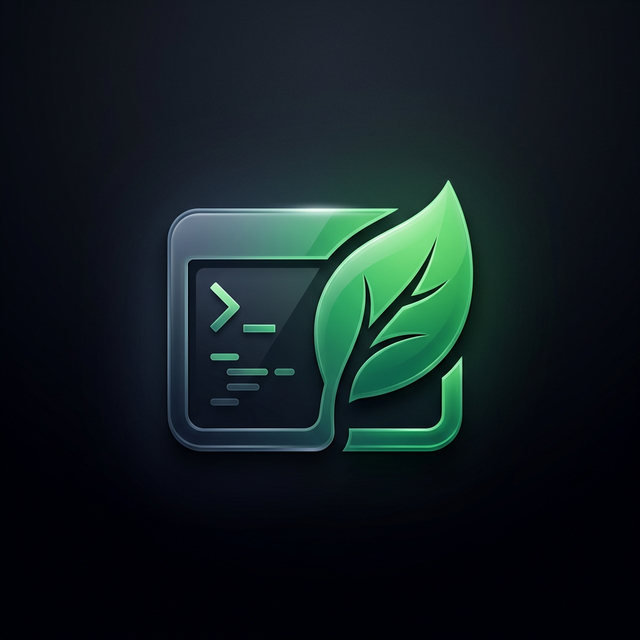
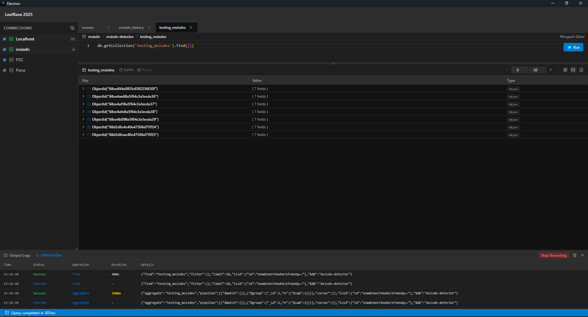
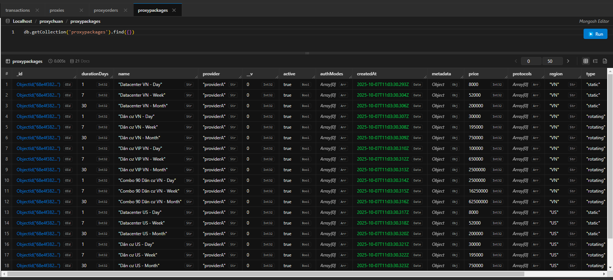
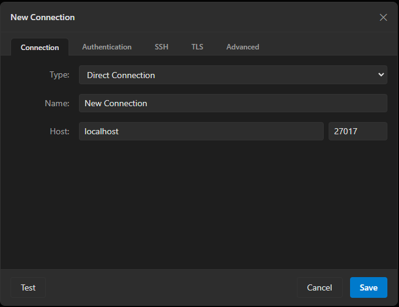

<p align="center">
  
</p>

<h1 align="center">LeafBase</h1>

<p align="center">
  <strong>A modern, cross-platform MongoDB GUI — the open-source successor to Robo3T.</strong>
</p>

<p align="center">
  
  
  
  
  
  
  
</p>

---

LeafBase is a high-performance, open-source MongoDB management tool built with Electron and React. It provides native support for MongoDB 4.4 through 8.0+, including advanced features like SSH Tunneling, TLS/SSL, and a rich results viewer (Tree, Table, JSON).

Developed with a focus on speed, aesthetics, and reliability, LeafBase offers a premium experience for database administrators and developers alike — completely free, no paywalls, no feature tiers.

## 📸 Screenshots

**Tree View — with type-detection badges and context menu**


**Table View — high-performance grid for large datasets**


**Connection Dialog — SSH, TLS, Authentication support**


---

## 🤔 Why LeafBase?

Robo3T was the go-to MongoDB GUI for hundreds of thousands of developers — lightweight, fast, and free. It was discontinued after acquisition. MongoDB Compass is the official alternative but is heavy and opinionated. Other OSS options are either unmaintained or lock core features behind a paywall.

**LeafBase fills that gap.** Same simplicity, modern codebase, actively maintained.

| Feature | LeafBase | Robo3T | MongoDB Compass |
|---|---|---|---|
| Free & open-source | ✅ | ✅ | ✅ |
| SSH Tunneling | ✅ | ✅ | ✅ (paid) |
| TLS/SSL | ✅ | ✅ | ✅ |
| Tree / Table / JSON views | ✅ | ⚠️ limited | ✅ |
| Monaco Editor | ✅ | ❌ | ❌ |
| APM Profiler | ✅ | ❌ | ❌ |
| Active development | ✅ | ❌ sunset | ✅ |
| Cross-platform | ✅ | ✅ | ✅ |

---

## Key Features

- **🚀 Native Performance**: Built on the official Node.js MongoDB driver for maximum compatibility.
- **🎨 Modern UI**: Sleek dark mode, intuitive layouts, and smooth micro-animations.
- **🔒 Secure Connectivity**: Native support for SSH Tunneling (Password/Private Key) and TLS/SSL.
- **🛠️ Rich Results Viewer**:
  - **Tree View**: Detailed view with type-detection badges (ObjectId, String, Date, etc.).
  - **Table View**: High-performance grid for large datasets.
  - **JSON View**: Formatted syntax-highlighted output.
- **⚡ Advanced Querying**: Professional editor powered by Monaco Editor.
- **📊 APM Profiler**: Real-time query performance monitoring.
- **📂 Multi-Connection**: Manage and switch between multiple local and remote instances seamlessly.

## 📥 Downloads

Ready-to-use binaries for Windows, macOS, and Linux are available on the **[Releases Page](https://github.com/vutranHS/leafbase/releases)**.

> [!TIP]
> **macOS (v1.0.9+)** is now officially **Digitally Signed** and **Notarized** by Apple. macOS users can open LeafBase directly. 
> 
> **Windows builds** are currently pending approval from [SignPath.io](https://signpath.io/). Until then, Windows users may still see a SmartScreen warning. Please refer to our **[Installation & Release Guide](RELEASE_GUIDE.md)** for more details.

## 🚀 Getting Started

### Prerequisites

- [Node.js](https://nodejs.org/) (v18 or higher)
- [npm](https://www.npmjs.com/) or [pnpm](https://pnpm.io/)

### Installation
```bash
$ git clone https://github.com/vutranHS/leafbase.git
$ cd leafbase
$ npm install
```

### Development
```bash
$ npm run dev
```

### Build & Distribution
```bash
# For Windows
$ npm run build:win

# For macOS
$ npm run build:mac

# For Linux
$ npm run build:linux
```

## 🗺️ Roadmap

See our full roadmap and vote on upcoming features in [FEATURES_REQUEST.md](../FEATURES_REQUEST.md).

**Already shipped in v1.0.8:** Workspace Sessions, Global Query History, Tab IDE Menus, SSH Auto-Reconnect, Export/Import Engine (JSON/CSV/BSON/XLSX), Monaco Editor.

**Coming soon:** Aggregation Pipeline Builder, Index Manager, Schema Analyzer, Query Explain Plan viewer.

## 🤝 Contributing

We welcome contributions from the community! Whether it's fixing a bug, adding a feature, or improving documentation:

1. Check out our **[Contributing Guidelines](CONTRIBUTING.md)**.
2. Fork the repository.
3. Submit a **Pull Request** using our professional template.

We are committed to fostering an open and welcoming environment.

## 🔐 Code Signing Policy

Free code signing provided by [SignPath.io](https://about.signpath.io/),
certificate by [SignPath Foundation](https://signpath.org/).

**Committer and reviewer:** vutranHS

**Privacy policy:**

This program will not transfer any information to other networked systems unless specifically requested by the user.
The only outbound network connections are to MongoDB servers explicitly configured and initiated by the user.
No telemetry, analytics, or usage data is collected or transmitted.

**Build process:**

Releases from **v1.0.9** onwards include officially signed **macOS binaries** using a **Verified Apple Developer Certificate**. 

**Windows code signing** is currently in the process of being integrated via [SignPath.io](https://about.signpath.io/).

---

## 📄 License

This project is licensed under the **MIT License**. See the [LICENSE](LICENSE) file for the full text.

---

<p align="center">Built with ❤️ by VuTran and the Open Source Community</p>
